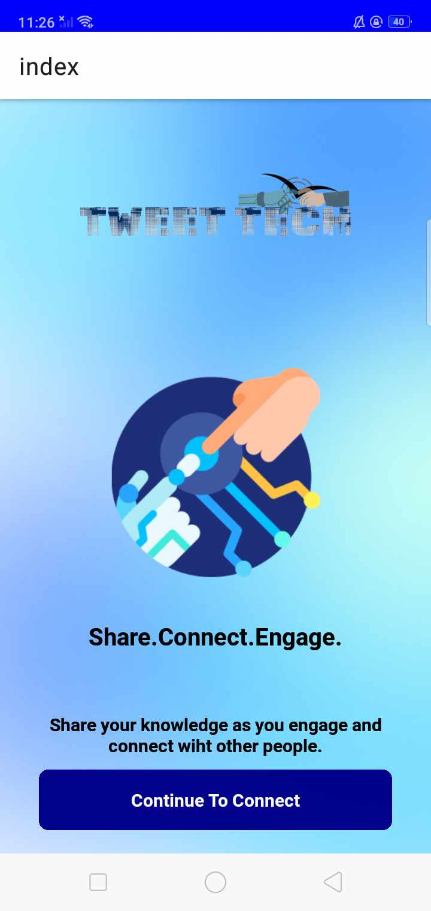

# TweetTech
TweetTech Mobile App.

# Features
* Personalized Content Feed
* User-Generated Content
* Gamification Elements

# Course Overview
* Personalized Content Feed Development
* Building Gamification Features
* User Registration & Authenticaiton
* Real-Time Messaging and Interaction
* Deployment and Scaling

# Tech Stack
* React Native
* AppWrite
* HTML, CSS and JS

# Home Screen
  

# Sign Up Screen
  

# Sign In Screen
  

# Tabs Screen
   
